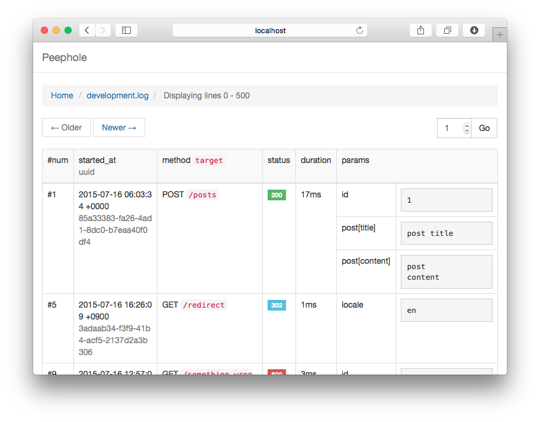

# Peephole

[](https://circleci.com/gh/tnantoka/peephole)
[](https://codeclimate.com/github/tnantoka/peephole)
[](https://codeclimate.com/github/tnantoka/peephole/coverage)

A log viewer engine for Rails.



## Installation

```
# Gemfile
gem 'peephole'

$ bundle

$ rails g peephole:install
      create  config/initializers/log_tags.rb
      create  config/initializers/peephole.rb
```

## Configuration

```
# config/initializers/peephole.rb
Peephole.configure do |config|
  config.paginates_per = 200
  config.peeper? do
    # current_user.role.admin?

    # admin_user_signed_in?

    # authenticate_or_request_with_http_basic do |user, pass|
    #   user == 'user' && pass == 'pass'
    # end
  end
end
```

## Example

```
$ git clone git@github.com:tnantoka/peephole.git
$ cd peephole/spec/dummy
$ rails s
$ open http://localhost:3000/peephole
```

## License

MIT

## Author

[@tnantoka][https://twitter.com/tnantoka]

